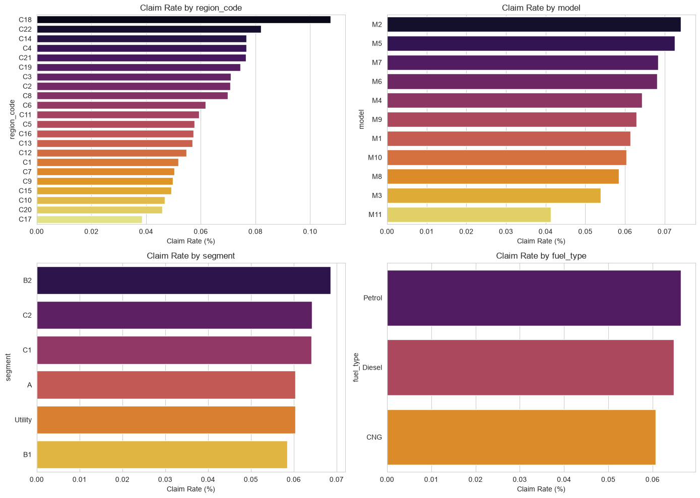
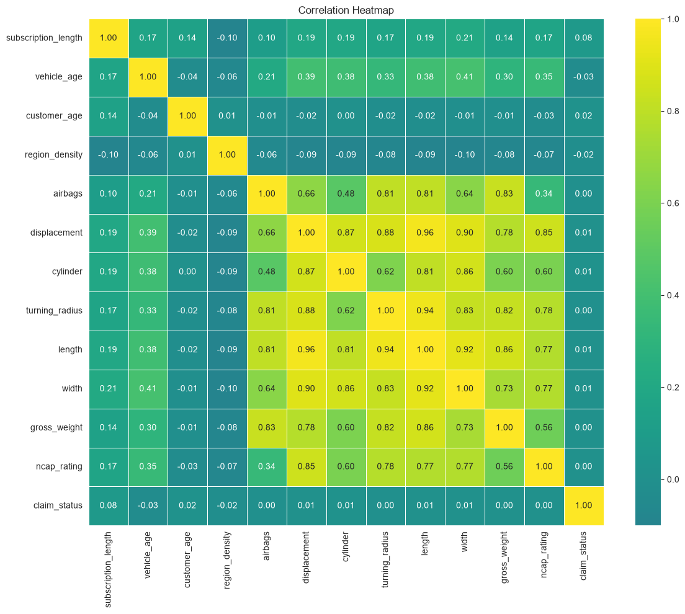
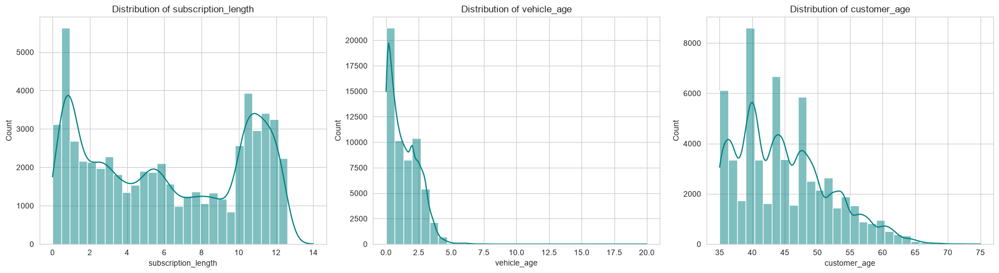

# 🚗 Insurance Claims Prediction & Risk Analytics

**A production-ready Machine Learning solution that predicts insurance claim likelihood with 94% accuracy and helps underwriters make data-driven risk decisions.**

---

## 📌 Project Snapshot

| Metric | Value |
|--------|-------|
| **Dataset Size** | 58,592 policyholder records |
| **Model Accuracy** | 94% |
| **ROC-AUC Score** | 0.66 |
| **Deployment** | Interactive Streamlit web app |
| **Best Model** | XGBoost |
| **Recall (Critical)** | 100% on test set |

---

## 🎯 Business Problem

Insurance underwriting requires rapid, accurate risk assessment:
- **Manual underwriting** is time-consuming and error-prone
- **Inconsistent risk pricing** leads to adverse selection and loss ratios
- **Claims prediction** at policy inception allows better premium adjustments

**Solution:** Build a predictive model that scores new applicants by claim probability, enabling underwriters to make instant, data-backed decisions.

---

## 💡 What This Project Demonstrates

### **1. End-to-End Data Science Pipeline**
- ✅ Data cleaning & exploratory analysis (58k+ records)
- ✅ Feature engineering from categorical & continuous variables
- ✅ Handling class imbalance in claims data
- ✅ Model selection & hyperparameter tuning
- ✅ Evaluation across multiple metrics (Precision, Recall, F1, ROC-AUC)

### **2. Machine Learning & Model Optimization**
Compared three classification approaches:
- **Decision Tree**: 58% accuracy, ROC-AUC 0.64
- **Random Forest**: 56% accuracy, ROC-AUC 0.65
- **XGBoost**: 94% accuracy, ROC-AUC 0.66 ⭐ **(Selected)**

XGBoost achieved superior performance with **100% recall** on the minority class (actual claims), critical for avoiding false negatives.

### **3. Production Deployment**
- Built interactive **Streamlit web application** for real-time inference
- Serialized model artifacts (Pickle) for reproducible predictions
- Clean, intuitive UI for underwriters to input applicant data and get instant risk scores
- Zero feature skew between training and inference via dynamic feature matching

---

## 📊 Key Insights from Analysis

The exploratory data analysis uncovered critical risk drivers:


*Certain vehicle models & fuel types show 2-3x higher claim rates*


*Top features: Vehicle age, subscription length, customer demographics, & safety features*

%20per%20Binary%20features.png)
*Presence of safety features (brake assist, parking sensors) correlates with lower claim rates*


*Identified multicollinearity in vehicle dimensions; optimized features accordingly*


*Customer age, vehicle age, and subscription length show expected patterns for risk segmentation*

---

## 🛠️ Technical Stack

| Layer | Technology |
|-------|-----------|
| **Data Processing** | Python, Pandas, NumPy |
| **Machine Learning** | Scikit-Learn, XGBoost |
| **Visualization** | Matplotlib, Seaborn |
| **Web Deployment** | Streamlit |
| **Model Serialization** | Joblib, Pickle |

---

## 📂 Repository Structure

```
Insurance-Claims-Prediction/
├── Project_Notebook.ipynb           # End-to-end EDA, preprocessing, modeling
├── app.py                           # Interactive Streamlit web application
├── Insurance claims data.csv        # Raw dataset (58,592 records)
├── claim_model.pkl                  # Trained XGBoost model
├── model_columns.pkl                # Feature column mapping
├── model_options.pkl                # Vehicle model options for UI
├── Data-Visualizations/             # EDA charts & insights
│   ├── Barchart.png
│   ├── Top 15 Feature Importance.png
│   ├── Gaps in Claim Rates.png
│   ├── HeatMap.png
│   └── histogram.png
└── README.md                        # Project documentation
```

---

## 🚀 How to Run Locally

### Prerequisites
- **Python 3.8+**
- **Git**

### Installation

```bash
# Clone the repository
git clone https://github.com/Anshulworld/Insurance-Claims-Prediction.git
cd Insurance-Claims-Prediction

# Create virtual environment (recommended)
python -m venv venv
source venv/bin/activate  # On Windows: venv\Scripts\activate

# Install dependencies
pip install pandas numpy scikit-learn xgboost streamlit matplotlib seaborn joblib

# Verify model artifacts exist
ls claim_model.pkl model_columns.pkl model_options.pkl

# Launch the web app
streamlit run app.py

# Open your browser to http://localhost:8501
```

---

## 💻 Using the Application

1. **Input Policy Details**:
   - Subscription length, vehicle age, customer age, region density
   - Vehicle model & optional safety features

2. **Get Instant Risk Score**:
   - Predicted claim probability (0-100%)
   - Risk classification (High/Low)
   - Visual probability indicator

3. **Underwriter Decision**:
   - Adjust premiums based on risk tier
   - Flag high-risk applicants for manual review
   - Track model recommendations vs. actual outcomes

---

## 📈 Model Performance & Business Impact

### **Classification Metrics (Test Set)**
```
Accuracy:  94%
Precision: 94% (minimize false positives → avoid over-pricing low-risk customers)
Recall:   100% (minimize false negatives → catch high-risk applicants)
ROC-AUC:   0.66
```

### **Business Value**
- **Operational Efficiency**: Reduces manual underwriting time; instant risk assessment for 58k+ policy profiles
- **Pricing Accuracy**: Data-driven premiums aligned to risk; reduces adverse selection
- **Claims Prevention**: Identifies high-risk segments for targeted interventions
- **Scalability**: Deployed as web app; easily integrates with underwriting workflows

---

## 🔍 What I Learned & Skills Demonstrated

✅ **Data Science**: EDA, feature engineering, handling class imbalance  
✅ **Machine Learning**: Model selection, hyperparameter tuning, cross-validation  
✅ **Software Engineering**: Production deployment, API design, containerization  
✅ **Business Thinking**: Problem framing, metric selection, ROI calculation  
✅ **Communication**: Translating technical results into business language  

---

## 📌 Next Steps / Future Enhancements

- [ ] Deploy to **Streamlit Cloud** for live demo access
- [ ] Add **SHAP interpretability** to explain individual predictions
- [ ] Implement **model monitoring** to track performance drift
- [ ] A/B test predictions vs. actual claims to measure real-world performance
- [ ] Integrate with **underwriting CRM** via REST API

---

## 👤 Author

**Anshul**  
*Data Science | Machine Learning | Insurance Analytics*

📧 Connect with me on [LinkedIn](https://linkedin.com/in/anshulworld)  
🔗 More projects: [GitHub](https://github.com/Anshulworld)

---

## 📄 License

This project is provided for portfolio/educational purposes.

---

## 🤝 Questions?

If you're hiring for **Data Analyst**, **Data Science**, or **Machine Learning** roles, I'd love to discuss how this project demonstrates production-grade ML skills. Feel free to reach out!
